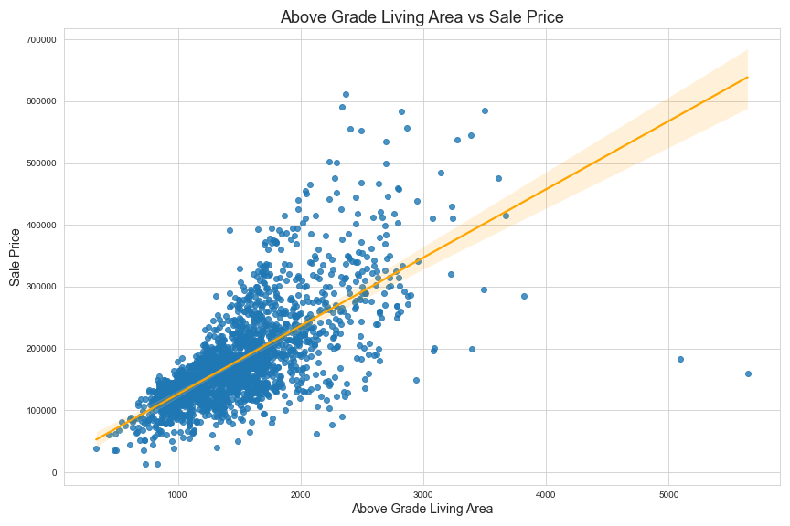
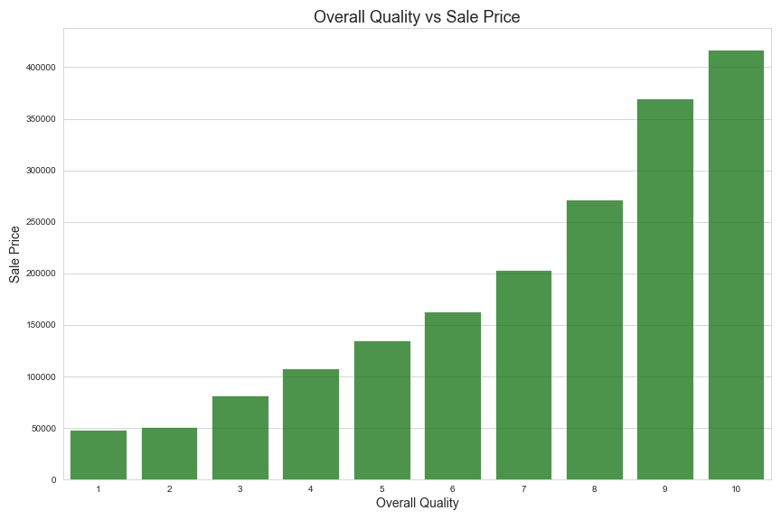

# Problem Statement

What features increase the value of a house the most?
___
# Data

## Size:
2051 entries, 81 features

## Source:
General Assembly DSIR 1213

Ames, Iowa Assessor’s Office

## Target:
Sale Price

 

<a href='http://jse.amstat.org/v19n3/decock/DataDocumentation.txt'>Data Dictionary</a> by Dean De Cock

 

## Example Plots:

*Interpretation: This scatter plot displays a positive linear correlation between the Above Grade Living Area and the Sale Price of a house.*

 

*Interpretation: This bar graph displays a steady increase in Sale Price as the Overall Quality of a house increases.*

___
# Model

When I first began the modeling phase of my project, I used regular linear regression, Lasso, and Ridge. Lasso and Ridge quickly outperfomed linear regression, so I switched my focus onto purely Lasso and Ridge.

Both of these two models beat the baseline score, with Ridge slightly beating out Lasso.

|Model|RMSE|
|---|---|
|Baseline|76,414|
|Lasso Regression|24,965|
|Ridge Regression|24,211|

___
# Recommendations

I believe that these 7 features (in no particular order) have the biggest impact in increasing the value of a house:

* Above Grade Living Area
* Garage Area
* Overall Quality
* Exterior Quality
* Basement Quality
* Kitchen Quality
* Neighborhood

___
# Next Steps

This project was a great first step into modeling. Gathering more data, combing through it, and continuing to fine tune the model are needed to get this model closer to production level. Once it is closer to that point, it will be interesting to see how it compares to other cities.